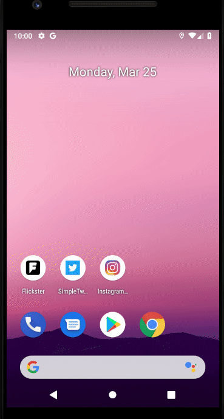

# Instagram-Clone
Submitted by: **Muneeb Khawaja**

**Instagram-Clone Part 2** is a photo sharing app similar to Instagram but using Parse as its backend.

Time spent: **6** hours spent in total

## User Stories

The following **required** functionality is completed:

* [x] User can view the last 20 posts submitted to "Instagram".
* [x] User can pull to refresh the last 20 posts submitted to "Instagram".
* [x] The user should switch between different tabs - viewing all posts (feed view), capture (camera and photo gallery view) and profile tabs (posts made) using fragments and a Bottom Navigation View. (2 points)

The following **optional** features are implemented:

* [x] Show the username and creation time for each post.
* [ ] User Profiles
* [ ] Allow the logged in user to add a profile photo
* [x] Display the profile photo with each post
* [x] Run your app on your phone and use a custom camera view
* [ ] User can tap a post to view post details, including timestamp and caption.
* [ ] Style the feed to look like the real Instagram feed.
* [ ] User can load more posts once he or she reaches the bottom of the feed using infinite scrolling.
* [ ] Tapping on a post's username or profile photo goes to that user's profile page and shows a grid view of the user's posts
* [ ] User can comment on a post and see all comments for each post in the post details screen.
* [ ] User can like a post and see number of likes for each post in the post details screen.

The following **additional** features are implemented:

* [x] User attribute for Profile Pictures was added server-side. If a user has a profile image, it will be 
	  displayed, other wise a black placeholder will be shown. 
* [x] Replaced the action bar with a custom tool-bar. Moved the logout button to the tool-bar and added the Instagram logo to the tool bar. 
* [x] Tweaked glide options to ensure a smoother image experience. (Overrides for dimensions, cropping etc.)
* [x] Added a proof-of-concept static section to the profile fragment. This section has as placeholder: user biography. 

## Video Walkthrough

 
GIF created with [ShareX](https://getsharex.com/).

# Instagram-Clone
Submitted by: **Muneeb Khawaja**

**Instagram-Clone** is a photo sharing app similar to Instagram but using Parse as its backend.

Time spent: **7** hours spent in total

## User Stories

The following **required** functionality is completed:

* [x] User can sign up to create a new account using Parse authentication.
* [x] User can log in and log out of his or her account.
* [x] The current signed in user is persisted across app restarts.
* [x] User can take a photo, add a caption, and post it to "Instagram".

The following **optional** features are implemented:

* [ ] User sees app icon in home screen and styled bottom navigation view
* [ ] Style the feed to look like the real Instagram feed.
* [ ] After the user submits a new post, show an indeterminate progress bar while the post is being uploaded to Parse.

The following **additional** features are implemented:
* [x] Added a menu to the action bar, with currently just the logout/exit button. 
* [x] The "Power Off/On" icon has a different function depending on where it is clicked. That is, if it is clicked when the context is the Login activity, 
	  then it exits the app, and if it is clicked during the Main Activity, then it simply logs the user out. 
* [x] Adopted the Instagram Color scheme. 	  

## Video Walkthrough

 
GIF created with [ShareX](https://getsharex.com/).

## Notes
I was trying to implement a much sleeker and nicer looking action bar, however, I faced diffeculties resizing menu item buttons and was unable to implement everything.
Most of the trouble I faced was encountered while setting up the Parse Server. On the Console, it would say that the Parse Dashboard is running at http://0.0.0.0:4040/
,however, that resulted in a ERR_ADDRESS_INVALID. It took me a while before figuring out that the Parse Dashboard was available at http://localhost:4040/ and not http://0.0.0.0:4040/.

## Open-source libraries used

- [Android Async HTTP](https://github.com/loopj/android-async-http) - Simple asynchronous HTTP requests with JSON parsing
- [Glide](https://github.com/bumptech/glide) - Image loading and caching library for Android

### License

    Copyright [2019] [Muneeb T. Khawaja]

    Licensed under the Apache License, Version 2.0 (the "License");
    you may not use this file except in compliance with the License.
    You may obtain a copy of the License at

        http://www.apache.org/licenses/LICENSE-2.0

    Unless required by applicable law or agreed to in writing, software
    distributed under the License is distributed on an "AS IS" BASIS,
    WITHOUT WARRANTIES OR CONDITIONS OF ANY KIND, either express or implied.
    See the License for the specific language governing permissions and
    limitations under the License.

